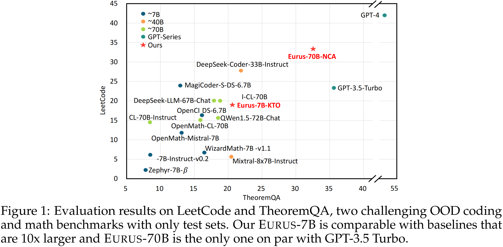
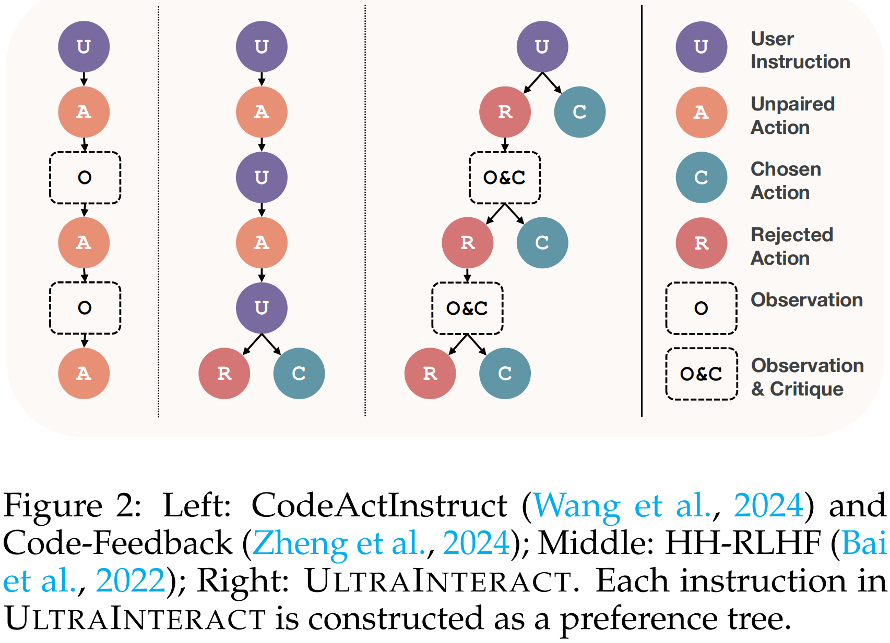
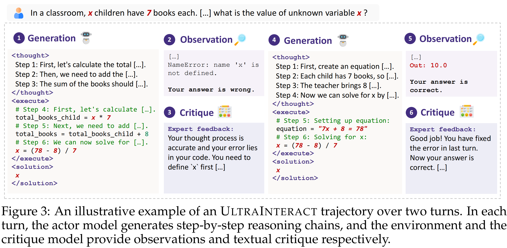

<div align="center">

<!--  -->

**A suit of open-source LLMs optimized for reasoning**

<p align="center">
 <a href="#introduction"> Introduction</a> •
 <a href="#ultrainteract">UltraInteract</a> •
 <a href="#eurus">Eurus</a> •
  <a href="#evaluation">Evaluation</a> •
</p>


</div>


# Links

- 📜 [Paper]()
- 🤗 [Eurus Collection]()
- 🤗 [UltraInteract]()

# Introduction

Finetuned from Mistral-7B and CodeLlama-70B, EURUS models achieve state-of-the-art results among open-source models on a diverse set of benchmarks covering mathematics, code generation, and logical reasoning problems. Notably, **EURUS-70B beats GPT-3.5 Turbo in reasoning through a comprehensive benchmarking across 12 tests covering five tasks**, and achieves a 33.3% pass@1 accuracy on LeetCode and 32.6% on TheoremQA, two challenging benchmarks, substantially outperforming existing open-source models by margins more than 13.3%. We also train a reward model which demonstrates especially strong preference modeling performance on reasoning tasks. 

The strong performance of EURUS can be primarily attributed to UltraInteract, a large-scale, high-quality alignment dataset specifically designed for complex reasoning tasks. UltraInteract can be used in both supervised fine-tuning and preference learning. For each instruction, it includes a preference tree consisting of (1) reasoning chains with diverse planning strategies in a unified format, (2) multi-turn interaction trajectories with the environment and the critique, and (3) pairwise data to facilitate preference learning. 



# UltraInteract

Conceptually, UltraInteract collects a preference tree for each instruction, with the instruction being the root and each action a node (Figure 2). A trajectory is a root-to-leaf path consisting of a sequence of actions. In each preference tree, all nodes of correct actions and all trajectories ending with correct actions can be used for SFT. Paired correct and incorrect nodes or trajectories can be used for preference learning.

## Structure


## Illustrative Example


## Stats


# Eurus

We release a suite of LLMs and a reward model. 

- Eurus-7B-SFT and Eurus-70B-SFT: Fine-tuned from Mistral-7B and CodeLLaMA-70B on all correct actions in UltraInteract, mixing a small proportion of UltraChat, ShareGPT, and OpenOrca examples.
- Eurus-7B-KTO and Eurus-70B-NCA: Preference fine-tuned on UltraInteract and UltraFeedback on top of SFT models.
- Eurus-RM-7B: Trained on a mixture of UltraInteract, UltraFeedback, and UltraSafet, with a specifically designed objective for reasoning:
$$
\mathcal{L}_{UltraInteract} = 
\underbrace{
-\log\Bigl(\sigma \bigl(r_{\theta}(x, y_{c})-r_{\theta}(x, y_{r})\bigr)\Bigr)
}_\text{$\mathcal{L_{\text{BT}}}$: optimize relative rewards} 
\underbrace{
-\log\Bigl(\sigma \bigl(r_{\theta}(x, y_{c})\bigr)\Bigr) -\log\Bigl(\sigma \bigl(-r_{\theta}(x, y_{r})\bigr)\Bigr)
}_\text{$\mathcal{L_{\text{DR}}}$: increase $r_{\theta}(x, y_{c})$ and decrease $r_{\theta}(x, y_{r})$}
$$
# Evaluation

## Eurus-7B and Eurus-70B
- EURUS, both the 7B and 70B variants, achieve the best overall performance among open-source models of similar sizes. EURUS even outperform specialized models in corresponding domains in many cases. Notably, EURUS-7B outperforms baselines that are 5× larger and EURUS-70B achieves better performance than GPT-3.5 Turbo. 
- Preference learning with UltraInteract can further improve the performance, especially in math and the multi-turn ability.


## Eurus-RM-7B
- EURUS-RM-7B stands out as the best 7B RM overall, and achieves similar or better performance than much larger baselines. Particularly, it outperforms GPT-4 in certain tasks.
- Our training objective is beneficial in improving RM performance on hard problems and reasoning.
- ULTRAINTERACT is compatible with other datasets like UltraFeedback and UltraSafety, and mixing these datasets can balance different RM abilities.
- EURUS-RM-7B improves LLMs’ reasoning performance by a large margin through reranking.


# Dataset Format
```jsonc
{

}
```


## Citation
```bib
@misc{yuan2024advancing,
      title={Advancing LLM Reasoning Generalists with Preference Trees}, 
      author={},
      year={2024},
      eprint={2404.},
      archivePrefix={arXiv},
      primaryClass={cs.CL}
}
```
