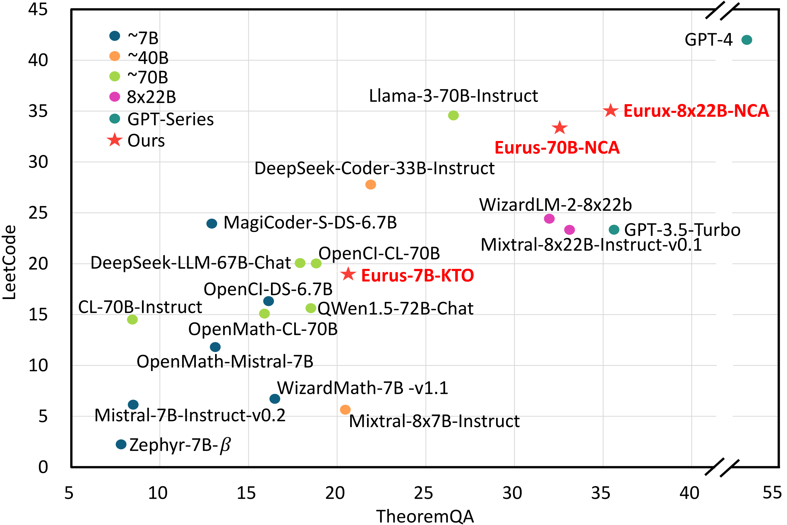
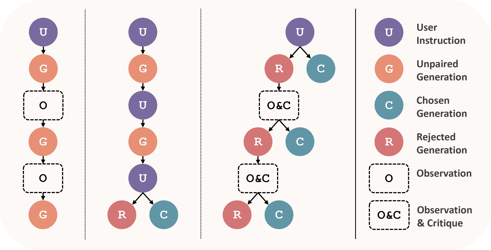
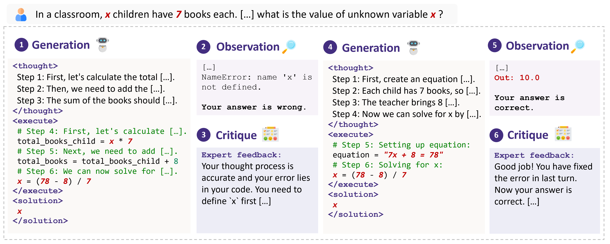
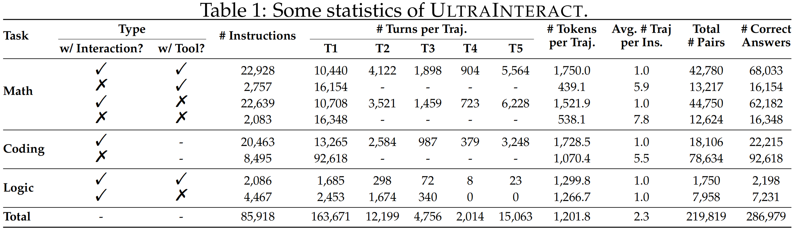
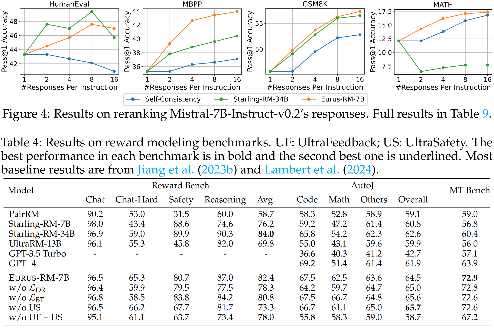

<div align="center">


**Eurus: A suite of open-source LLMs optimized for reasoning**

<p align="center">
 <a href="#introduction"> Introduction</a> •
  <a href="#evaluation">Evaluation</a>
</p>


</div>


# Links

- 📜 [Paper](https://arxiv.org/abs/2404.02078)
- 🤗 [Eurus Collection](https://huggingface.co/collections/openbmb/eurus-660bc40bec5376b3adc9d1c5)
- 🤗 UltraInteract
  - [SFT](https://huggingface.co/datasets/openbmb/UltraInteract_sft)
  - [Preference Learning](https://huggingface.co/datasets/openbmb/UltraInteract_pair) 
# Introduction

## Eurus



We release a suite of LLMs and a reward model. **Eurus-70B beats GPT-3.5 Turbo in reasoning through a comprehensive benchmarking across 12 tests covering five tasks**, and achieves a 33.3% pass@1 accuracy on LeetCode and 32.6% on TheoremQA, two challenging benchmarks, substantially outperforming existing open-source models by margins more than 13.3%. We also train a reward model that demonstrates especially strong preference modeling performance on reasoning tasks. 

- *Eurus-7B-SFT* and *Eurus-70B-SFT*: Fine-tuned from Mistral-7B and CodeLLaMA-70B on all correct actions in UltraInteract, mixing a small proportion of UltraChat, ShareGPT, and OpenOrca examples.
- *Eurus-7B-KTO* and *Eurus-70B-NCA*: Preference fine-tuned on UltraInteract and UltraFeedback on top of SFT models.
- *Eurus-RM-7B*: Trained on a mixture of UltraInteract, UltraFeedback, and UltraSafety.


## UltraInteract

The strong performance of Eurus can be primarily attributed to UltraInteract, a large-scale, high-quality alignment dataset specifically designed for complex reasoning tasks. For each instruction, it includes a preference tree consisting of 
- (1) reasoning chains with diverse planning strategies in a unified format
- (2) multi-turn interaction trajectories with the environment and the critique
- (3) pairwise data to facilitate preference learning

### Structure
UltraInteract collects a preference tree for each instruction, with the instruction being the root and each action a node. A trajectory is a root-to-leaf path consisting of a sequence of actions.
In each preference tree, all nodes of correct actions and all trajectories ending with correct actions can be used for SFT. Paired correct and incorrect nodes or trajectories can be used for preference learning.



### Illustrative Example
Here is an illustrative example of an UltraInteract trajectory over two turns. In each turn, the actor model generates step-by-step reasoning chains, and the environment and the critique model provide observations and textual critique respectively.



### Stats
Below are some statistics about UltraInteract. It consists of 86k instructions, 286k correct answers, and 219k pairs.




# Evaluation

## Eurus-7B and Eurus-70B
- Eurus, both the 7B and 70B variants, achieve the best overall performance among open-source models of similar sizes. Eurus even outperforms specialized models in corresponding domains in many cases. Notably, Eurus-7B outperforms baselines that are 5× larger, and Eurus-70B achieves better performance than GPT-3.5 Turbo. 
- Preference learning with UltraInteract can further improve performance, especially in math and the multi-turn ability.


## Eurus-RM-7B
- Eurus-RM-7B stands out as the best 7B RM overall and achieves similar or better performance than much larger baselines. Particularly, it outperforms GPT-4 in certain tasks.
- Our training objective is beneficial in improving RM performance on hard problems and reasoning.
- ULTRAINTERACT is compatible with other datasets like UltraFeedback and UltraSafety, and mixing these datasets can balance different RM abilities.
- Eurus-RM-7B improves LLMs’ reasoning performance by a large margin through reranking.




# Dataset Format

## SFT

**Coding**
```JSONC
{
    "id": "92a7356beaa75391539cb79624bdf85b7e5d36d5e74e46a2f1c4001f40b3e055_1_1", // unique data id, contains three parts, the unique string, the depth of the preference tree, and current turn, separated by '_'
    "parent_id": "535550938ff58bd73cd7fb85be834bb90b7600daf6b6f6a16b64091e5ecbfe43", // data with the same parent_id have the same instruction but different actions.
    "task": "Coding", // task type, choices = ["Coding", "Math_Cot", "Math_PoT", "Logic"]
    "dataset": "codecontest", // the dataset where the instruction comes from
    "instruction": "Write Python code to solve the task.\nMike has a string s consisting of only lowercase English letters. He wants to change exactly one character from the string so that the resulting one is a palindrome. \n\nA palindrome is a string that reads the same backward as forward, for example strings \"z\", \"aaa\", \"aba\", \"abccba\" are palindromes, but strings \"codeforces\", \"reality\", \"ab\" are not.\n\nInput\n\nThe first and single line contains string s (1 ≤ |s| ≤ 15).\n\nOutput\n\nPrint \"YES\" (without quotes) if Mike can change exactly one character so that the resulting string is palindrome or \"NO\" (without quotes) otherwise. \n\nExamples\n\nInput\n\nabccaa\n\n\nOutput\n\nYES\n\n\nInput\n\nabbcca\n\n\nOutput\n\nNO\n\n\nInput\n\nabcda\n\n\nOutput\n\nYES",  // the task description.
    "response": "
        Step 1: This problem asks us to determine if it is possible to change exactly one character in the string to make it a palindrome.
        Step 2: We can start by iterating through the characters in the string and counting the number of differences between corresponding characters from the beginning and end of the string.
        Step 3: If the length of the string is odd and there is only one difference, or if the length is even and there is exactly one difference, then it is possible to change exactly one character to make the string a palindrome.
        Step 4: We need to consider edge cases such as a single character string or an empty string.

        ```python
        # Step 5: Take the input string
        s = input()
        # Step 6: Calculate the length of the string
        n = len(s)
        # Step 7: Initialize a counter to keep track of the number of differences
        cnt = 0
        # Step 8: Iterate through the first half of the string and count the number of differences between corresponding characters from the beginning and end of the string.
        for i in range(n//2):
            if s[i] != s[n-i-1]:
                cnt += 1
        # Step 9: If the length of the string is odd and there are no differences, or if the length is even and there is exactly one difference, print "YES" (without quotes)
        if (n % 2 == 1 and cnt == 0) or (cnt == 1):
            print('YES')
        # Step 10: Otherwise, print "NO" (without quotes)
        else:
            print('NO')
        ```" // The step-by-step solution.
}
```

**Math**
```JSONC
{
    "id": "647b2e8706cf459a8e3ec8e99727d2d51ff3414bf187db43d92cff87f8012713_1_1",
    "parent_id": "499d250c5852eddcd48a28b6c173f1a2349a16555990a1cd6fb5c7954cb94587",
    "task": "Math_PoT",
    "dataset": "mathqa",
    "instruction": "Tool available:\n[1] Python interpreter\nWhen you send a message containing Python code to python, it will be executed in a stateful Jupyter notebook environment.\nSolve the following math problem step-by-step.\nthe length of a rectangle is doubled while its width is doubled . what is the % change in area ?",
    "response": "
        Step 1: The area of a rectangle is given by the product of its length and width. If the length is doubled, the area changes from l*w to 2l*w. Similarly, if the width is doubled, the area changes from l*w to l*2w. 
        Step 2: If both the length and width are doubled, the area changes from l*w to 2l*2w. The percentage change in area is given by ((new area - old area) / old area)*100.
        Step 3: We can calculate the percentage change in area using the formula above.
        Step 4: By creating a tool to calculate the percentage change in area, we can easily solve the question.

        ```python
        # Step 5: Define a tool to calculate the percentage change in area
        def calculate_percentage_change(length, width):
            # Step 6: Calculate the old and new areas
            old_area = length * width
            new_area = 2 * length * 2 * width
            # Step 7: Calculate the percentage change
            percentage_change = ((new_area - old_area) / old_area) * 100
            return percentage_change
        # Step 8: Call the function to solve the question
        percentage_change = calculate_percentage_change(2, 2)
        print(percentage_change)
        ```"
}
```

**Logic**
```JSONC
{
    "id": "92a19848da4fb0fc0b414f061f7500a81ea4cbd8f922ca1e32a6a15ef6f7e1a0_1_1",
    "parent_id": "107cc9147d8c09e62e2ba9e74cb41d9dbafd9a3adf62b67ba3da2b31c81b3300",
    "task": "Logic",
    "dataset": "hotpotqa",
    "instruction": "
        Tool available:\n[1] wikipedia_search(query: str) -> str\nThe Wikipedia Search tool provides access to a vast collection of articles covering a wide range of topics.\nCan query specific keywords or topics to retrieve accurate and comprehensive information.
        Solve the following problem step-by-step:\nWhich musician or group is from the US, 3OH!3 or Regina Spektor? 
        Step 1: To determine which musician or group is from the US, we can search for information about each of them.
        ```python
        # Step 2: Searching for the information about 3OH!3.
        print(wikipedia_search('3OH!3'))
        ```
        Page: 3OH!3
        Summary: 3OH!3 (pronounced \"three oh three\") is an American electronic music duo from Boulder, Colorado, made up of Sean Foreman and Nathaniel Motte. They are best known for their single \"DONTTRUSTME\" from their album Want, which reached number seven on the Billboard Hot 100. Their second single, a remix of \"Starstrukk\" featuring Katy Perry from Want, was a top ten hit in the United Kingdom, Ireland, Finland, Poland, and Australia. They gained further recognition by featuring Kesha on the song \"My First Kiss\", which was made the lead single from their album Streets of Gold. The album later peaked at number seven on the Billboard 200.\n\n\n\nPage: 3OH!3 (album)\nSummary: 3OH!3  is the debut studio album by American electronic music band 3OH!3. The tracks \"Holler Til You Pass Out\" and \"Chokechain\" were later remixed for the band's major label debut. \"Holler Til You Pass Out\", \"Chokechain\", and \"Dance with Me\" are excluded from the iTunes release of the album.",
    "response": "
        Step 1: The provided information confirms that 3OH!3 is an American electronic music duo from Boulder, Colorado.
        Step 2: We no longer need to perform a search for Regina Spektor as we were only tasked to determine which of the two options is from the US and we have already confirmed 3OH!3's origin.
        Step 3: We can confidently conclude that 3OH!3 is the musician/group from the US.
        Answer:3OH!3"
}
```

## Preference Learning

```JSONC
{
	"id": "d1f094e0e13096bc1bb6260e1e0d807e2c4ebfbbf4a4373f04cbed001c385c3c_5_3", // unique data id, contains three parts, the unique string, the depth of the preference tree, and current turn, separated by '_'
	"parent_id": "d1f094e0e13096bc1bb6260e1e0d807e2c4ebfbbf4a4373f04cbed001c385c3c",  // data with the same parent_id have the same instruction but different actions.
	"task": "Math_PoT", // task type, choices = ["Coding", "Math_Cot", "Math_PoT", "Logic"]
	"dataset": "MATH", // the dataset where the instruction comes from
    "trajectory": [
        {
            "from": "user",
            "value": "Tool available:\n[1] Python interpreter\nWhen you send a message containing Python code to python, it will be executed in a stateful Jupyter notebook environment.\nSolve the following math problem step-by-step.\nSimplify your answer as much as possible.\nSimplify $(-3-2i)-(1+4i)$." // the task instruction
        },
        {
            "from": "assistant",
            "value": "Step 1: To simplify the expression $(-3-2i)-(1+4i)$, we need to distribute the negative sign to both terms inside the parentheses.\nStep 2: We can then combine like terms by adding the real parts and the imaginary parts separately.\n```python\n# Step 3: Distribute the negative sign to both terms inside the parentheses.\n(-3) - (-1) + (-2i) - (-4i)\n# Step 4: Combine like terms by adding the real parts and the imaginary parts separately.\n-3 + 1 + (-2i + 4i)\n```" // the assistant's action (turn 1)
        },
        {
            "from": "user",
            "value": "Out: Cell In[1], line 2\n    (-3) - (-1) + (-2i) - (-4i)\n                     ^\nSyntaxError: invalid syntax\nYour answer is wrong.\nYour thought process for simplifying the given complex numbers is correct. However, you made a syntax error in the code. In Python, the multiplication operation must be explicitly written out with an asterisk (*), even for complex numbers. Remember, the imaginary unit in Python is denoted as j and not i. Try correcting the syntax and calculate again."  // the observation from python interpreter and feedback (turn 1)
        },
        {
            "from": "assistant",
            "value": "Step 1: To simplify the expression $(-3-2i)-(1+4i)$, we need to distribute the negative sign to both terms inside the parentheses.\nStep 2: We can then combine like terms by adding the real parts and the imaginary parts separately.\n```python\n# Step 3: Distribute the negative sign to both terms inside the parentheses.\n(-3) - (-1) + (-2j) - (-4j)\n# Step 4: Combine like terms by adding the real parts and the imaginary parts separately.\n-3 + 1 + (-2j + 4j)\n```"  // the assistant's action acording to the observation and feedback.(turn 2)
        },
        {
            "from": "user",
            "value": "Out: (-2+2j)\nYour answer is wrong.\nYour thought process for simplifying the given complex numbers is on the right track. However, you made an arithmetic error when adding the real parts (-3 + 1 ≠ -2) and the imaginary parts (-2j + 4j ≠ 2j). You should have combined the like terms correctly to get the right answer -4 and -6j respectively. Please try again with the correct arithmetic calculations."  // the observation from python interpreter and feedback. (turn 2)
        }
    ] // trajectory is the interaction between user and assistant, and the first element is the task instruction.
    "chosen": "Step 1: Split the expression into real and imaginary terms.\nStep 2: Subtract the real terms from each other.\nStep 3: Subtract the imaginary terms from each other.\nStep 4: Combine the results of the subtraction to get the simplified form of the expression.\n\n\n\n```python\n# Step 5:  Split the expression into real and imaginary parts and then subtract them.\nreal_part = -3 - 1  # Subtract the real parts\nimaginary_part = -2 - 4  # Subtract the imaginary parts\n# Step 6:  Combine the real and imaginary parts to get the result.\nresult = f\"{real_part}{imaginary_part:+d}i\"\nprint(result)\n```", // the chosen answer based on the trajectory.
	"rejected": "Step 1: To simplify the expression $(-3-2i)-(1+4i)$, we need to distribute the negative sign to both terms inside the parentheses.\nStep 2: We can then combine like terms by adding the real parts and the imaginary parts separately.\n```python\n# Step 3: Distribute the negative sign to both terms inside the parentheses.\n(-3) - 1 - (-2j) - 4j\n# Step 4: Combine like terms by adding the real parts and the imaginary parts separately.\n-3 - 1 - 2j - 4j\n```",  // the rejected answer based on the trajectory.
}
```


## Citation
```bib
@misc{yuan2024advancing,
      title={Advancing LLM Reasoning Generalists with Preference Trees}, 
      author={Lifan Yuan and Ganqu Cui and Hanbin Wang and Ning Ding and Xingyao Wang and Jia Deng and Boji Shan and Huimin Chen and Ruobing Xie and Yankai Lin and Zhenghao Liu and Bowen Zhou and Hao Peng and Zhiyuan Liu and Maosong Sun},
      year={2024},
      eprint={2404.02078},
      archivePrefix={arXiv},
      primaryClass={cs.AI}
}
```
